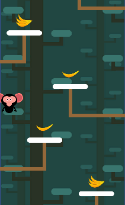

# Game-1-Banana-Jump
Game banana jump ini saya buat dengan mengikuti beberapa latihan cara membuat game di youtube dan beberapa course yang saya temukan. Setelah mengumpulkan beberapa vidio untuk latihan pemrograman bahasa C# saya mencoba untuk mengimplemntasikan dan menjadikan sebuah game. Dari situ lah game banana jump ini saya coba buat dengan mengikuti tutorial.

Gameplay dari game banana jump ini kurang lebih hampir sama dengan permainan pou yang mode game awan. Karakter harus jump ke bagian kotak putih agar tidak jatuh kebawah. Untuk game banana jump sendiri jump nya menggunakan sebuah pisang yang ada di kotak2 putih. Untuk satu pisang loncatnya tidak terlalu tinggi, dan kalau mendapatkan lebih dari satu pisang karakter akan lompat tinggi keatas. Jadi pemain tinggal mengarahkan arah karakter untuk mendarat ke bagian kotak putih-putih dengan menekanan arah panah keyboard kanan dan kiri. Pemain juga harus memperhatikan obstacle, di game ini terdapat sebuah burung untuk di hindari.

Untuk gambaran game Banana Jump sendiri seperti di bawah ini
  
 
